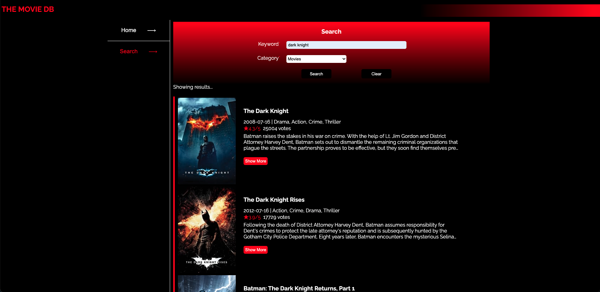
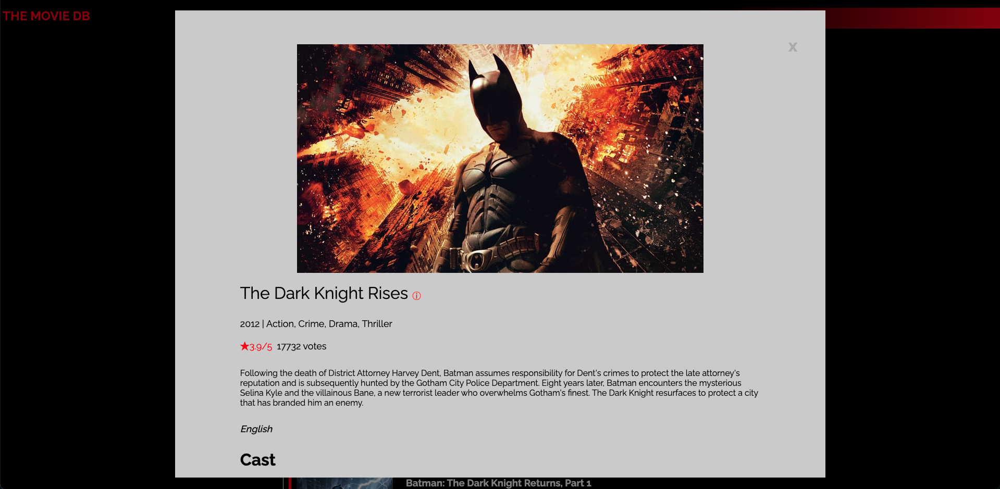

# Simple Films - film website

Simple website displays trending movies and tv shows and search functionalities from [TMDB](https://www.themoviedb.org/) live on [Here](https://my-hw-app.azurewebsites.net/) (might take a while to activate the container).

## Table of contents

- [General info](#general-info)
- [Technologies](#technologies)
- [Screen Shots](#screenshots)
- [Setup](#setup)

## General info

1. Home page displays trending movies and tv shows
2. Search pages can search for any movie and tv shows and view the detail (casts, reviews, poster)
3. Host on [Azure](https://my-hw-app.azurewebsites.net/) (might take a while to activate the container)

## Technologies

Project is created with:

- HTML, CSS, Vanilla Javascript
- Flask
- Azure

## Screen Shots





## Setup

To run this project, install it locally using python:

```
$ source venv/bin/activate
$ pip install -r requirements.txt
$ export FLASK_APP=app.py
$ flask run
```
